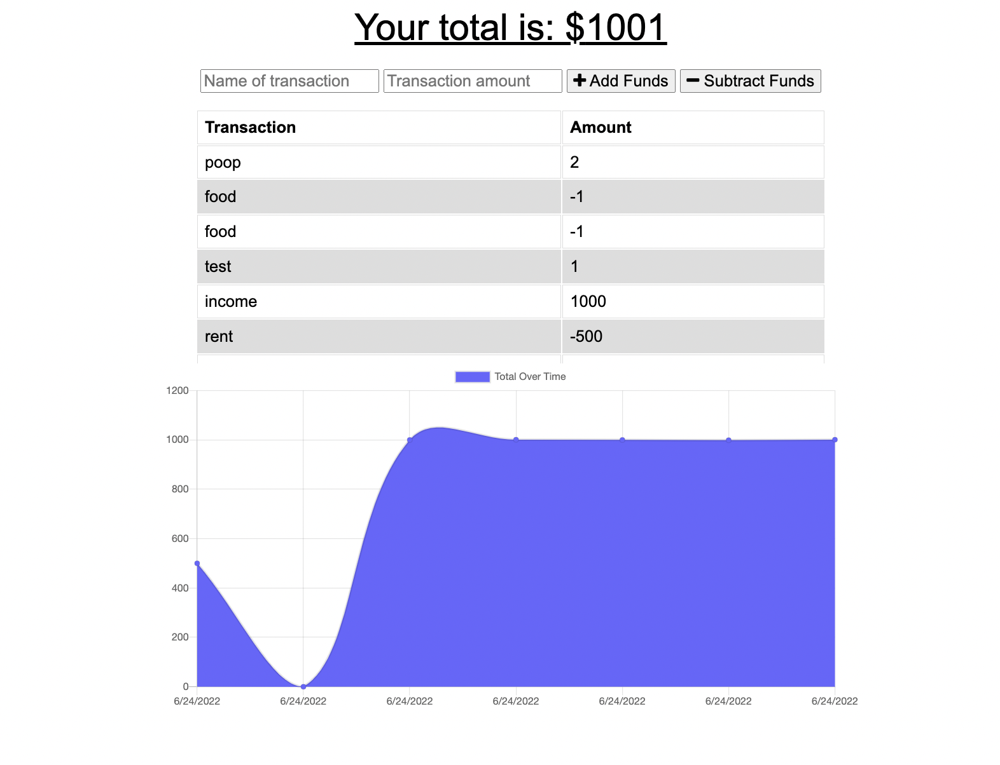

<h1 align="center">Welcome to my Budget Tracker Application👋</h1>
<p>
  
  <a href="https://github.com/Brainybrian316/Budget-Tracker#readme" target="_blank">
    
  </a>
  <a href="https://github.com/Brainybrian316/Budget-Tracker/graphs/commit-activity" target="_blank">
    
  </a>
  <a href="https://opensource.org/licenses/MIT" target="_blank">
    
  </a>
</p>

> A Full-Stack mobile-first progressive web application that allows users to track their budgets by adding expenses and income. The application also allows users to see a visual representation of their budget via a graph. They are able to add a transaction with or without connection. Transactions are stored in the indexedDB and transferred to the server. The server then stores the transactions in a MongoDB database when the user returns online. Utilizes IndexedDB(for offline support) MongoDB, Express, Service Workers, and Node.js.
***
## Demo of Project 


<h3>✨ ScreenShot</h3>



***
## Install

To install all dependencies you need only to run:
```sh
npm init -y
```
```sh
npm install
```
However, if you plan on editing data you may find it helpful to install Nodemon running: 
```
npm install --save-dev nodemon
```
Please review <a href ="https://www.npmjs.com/package/nodemon">Nodemon</a> documentation if you are unfamiliar with the package.

***
## Usage
Run the following command at the root of your project to start the server:
Nodemon:
```sh
npm run start:dev

```
Server:
```sh
npm start
```

You can download <a href="https://insomnia.rest/download">Insomnia</a> to manipulate/test the data with the GET or POST request.

***
## Meet the Developer


